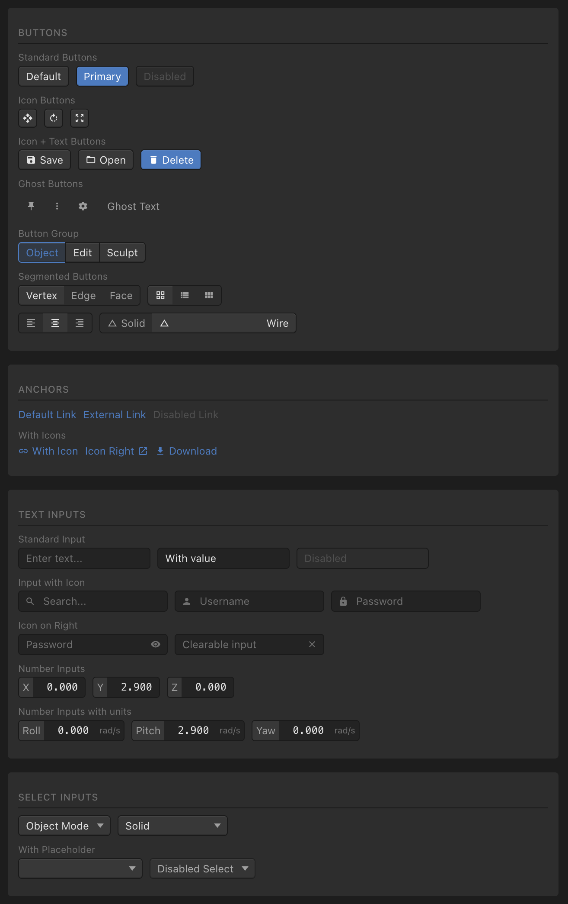

# NightShift

A Mithril.js component library inspired by mid 2000s DAWs and 3D modelling tools.



I've always had a soft spot for the gray, cramped, skeuomorphic aesthetic popular in 'pro' apps from the mid-2000s to mid-2010s - before the web became obsessed with excessive whitespace and smooth transitions. This project aims to revive that retro look for dense, responsive professional tools - the sort of UI you'll be staring at late into the night.

Note: This isn't a production-ready toolkit - just some inspiration for dashboards I'd like to build.

## Setup

```bash
npm install
```

## Development

```bash
npm run dev
```

Opens at http://localhost:3000

## Build

```bash
npm run build
```

Output goes to `dist/`.

## Format

```bash
npm run format
```
